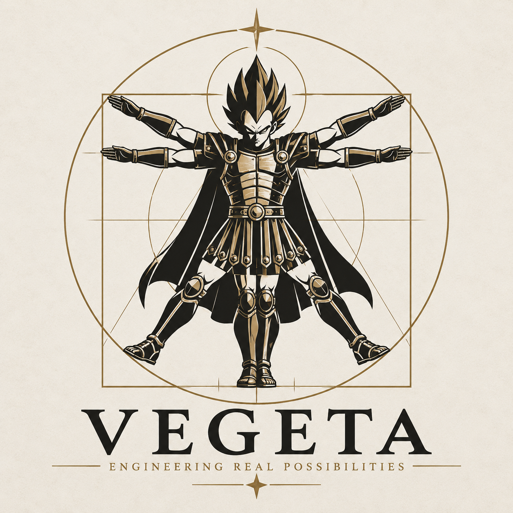

<p align="center"></p>

# Vegeta

A Python-first, human-in-the-loop engineering workbench built from small,
independent engineering tools, shipped together as one installable package, **`vegeta-cli`**
(`from vegeta import dedalus, talos, aeromant, mellonia`):

| Package | Job | Wraps | Consumes → Produces |
|---------|-----|-------|---------------------|
| **Dedalus** | parametric CAD | CadQuery | Python design → STEP, STL, measurements |
| **Talos** | linear static FEA | Gmsh + CalculiX | STEP + explicit config → mesh, `.inp`, `.frd`/`.dat`, summary |
| **Aeromant** | aerodynamics / CFD | OpenFOAM | STL + template case + explicit values → case, logs, Cd/Cl/Cm |
| **Mellonia** | 3D-print manufacturability | PrusaSlicer | STL + explicit print settings → G-code, time, material |
| **Vegeta Core** | workbench | the four above | workspaces, immutable revisions, recorded evaluations, NOT RUN |

Dedalus designs. Talos tests structures. Aeromant tests aerodynamics.
Mellonia tests manufacturability. Vegeta organizes the engineer's work.

## Principles
- The four engineering tools are **independent** subpackages (`vegeta.dedalus`, ...): none imports
  another or any other part of Vegeta (enforced by tests). `vegeta` is a namespace package so more
  distributions can join it later.
- Each is a plain Python library, usable from a script or Jupyter, with a thin CLI on top
  (`vegeta <tool> ...`, or the shortcuts `dedalus`, `talos`, `aeromant`, `mellonia`).
  No server, database or background service. A GUI comes later, on top of the same API.
- Configuration happens in **Python** (dataclasses / keyword arguments), not config files.
- Packages compose through **files**: STEP, STL, meshes, CalculiX decks, OpenFOAM cases, G-code.
- Native solver artifacts are always kept; `summary.json` is a convenience, not a replacement.
- Nothing is guessed: supports, loads, materials, CFD values and print settings are explicit.
- Nothing runs automatically: every analysis is started by the engineer.

## Status
Stages 1–9 are implemented: the four independent tools (Python API, CLI, validated tests, docs,
notebooks) and Vegeta Core (workspaces, immutable revisions, branching, labels, recorded
evaluations, NOT RUN status; [docs/core.md](docs/core.md), `06_core_revisions`). Next: comparison and
sweeps, then a GUI — see [`todo.md`](todo.md).

| package | CLI | validation | guide | notebook |
|---------|-----|------------|-------|----------|
| Dedalus | `vegeta dedalus params/generate/measure` | exact box/hole volumes, STEP round trip | [docs/dedalus.md](docs/dedalus.md) | `01_dedalus_cad` |
| Talos | `vegeta talos inspect/mesh/solve/results` | cantilever vs beam theory (−0.6 %), bar F/A, gravity | [docs/talos.md](docs/talos.md) | `02_talos_fea` |
| Aeromant | `vegeta aeromant templates/prepare/run/results` | sphere Re=100 Cd 1.100 vs 1.092 | [docs/aeromant.md](docs/aeromant.md) | `03_aeromant_cfd` |
| Mellonia | `vegeta mellonia slice/parse` | layer counts, solid cube volume (+0.9 %) | [docs/mellonia.md](docs/mellonia.md) | `04_mellonia_print` |
| Boreas | `vegeta boreas point/for-thrust/map` | T~n², P~n³, momentum limit, APC 10x4.7 static point | [docs/boreas.md](docs/boreas.md) | `11_`, `12_` propeller |
| Chronos | `vegeta chronos spectrum/life` | ASTM E1049 rainflow example, DAF = 1/2ζ at resonance, Miner sums | [docs/chronos.md](docs/chronos.md) | `13_`, `14_` life |

Product-level notebooks — the whole workflow on one design, with revisions and visualisation:
`08_quadcopter` (printed X-frame: two load cases, three revisions, drag with a canopy, slicing) and
`09_fixed_wing_drone` (twin-motor fixed wing: wing pull-up and engine-out cases, whole-aircraft RANS with
level-flight speed and endurance, nacelle slicing). `07_ai_design_copilot` iterates a design with Claude; `10_agentic_design` lets Claude run a bounded
parameter campaign (FEA on every candidate, criteria, budget, approval policy) in a workspace.
`11_`/`12_` size the propellers (Boreas) and export the rpm, thrust and excitation data;
`13_quadcopter_life` and `14_fixed_wing_life` take that data through modal analysis, three mission
types, rainflow spectra, fatigue on the FEA stress fields and a fleet-usage life simulation (Chronos +
Talos). `16_boat_at_sea` (branch `dev_sea`) takes a 1 m survey boat from hull lines through hydrostatics and the GZ curve,
resistance and propulsion in water, slamming and thrust structure, three sea states and fatigue life.
Shared design files live in `notebooks/designs/`.

More: [philosophy](docs/philosophy.md) · [result shape](docs/result-shape.md) ·
[installation](docs/installation.md) · [composition through files](docs/composition.md) ·
[Vegeta Core](docs/core.md) · [AI copilot](docs/ai.md).

### The names
Every tool is a figure from Greek myth, one word, easy to say in a meeting:
Dedalus the craftsman (CAD), Talos the bronze giant (structure), Aeromant "reader of the air" (CFD),
Mellonia the goddess of bees and their wax (3D printing), Boreas the north wind (propellers and
rotors), Chronos time (missions, cyclic loads, life). The workbench itself is Vegeta.

## Layout
```
vegeta-cli/        the vegeta-cli package: src/vegeta/{cli,dedalus,talos,aeromant,mellonia,boreas,chronos}, tests/<tool>/
vegeta-core/       the vegeta-core package: src/vegeta/core (workspaces, revisions), adds `vegeta ws|rev`
vegeta-ai/         the vegeta-ai package: src/vegeta/ai (Claude design copilot), adds `vegeta ai`
notebooks/         one notebook per package, the workflow, core, AI copilot and two product designs
docs/              philosophy, result shape, installation, composition, per-package guides
examples/cli/      input files for the CLI demo (Talos model, Aeromant case, Mellonia settings)
install_local.sh   creates .venv, installs all dependencies and vegeta-cli
test.sh            checks the installation (components + a short working run)
jupyter.sh         starts JupyterLab from .venv
scripts/           test_all.sh, run_notebooks.sh, demo_cli.sh
```

## Quick start
```bash
./install_local.sh                  # .venv first, then apt tools, OpenFOAM, vegeta-cli, JupyterLab
./test.sh                           # check the installation; prints OK/MISSING/FAILED per part
./jupyter.sh                        # JupyterLab from the venv; start with notebooks/00_smoke_test.ipynb
source .venv/bin/activate           # for the vegeta command and the scripts below
scripts/test_all.sh                 # each package tested on its own
scripts/run_notebooks.sh            # execute the notebooks headlessly
scripts/demo_cli.sh                 # CAD -> FEA -> print -> CFD using only the CLIs
```

## Licence
Proprietary — **internal use only** (see `LICENSE`). External tools keep their own licences, see
`THIRD_PARTY_LICENSES.md`.
