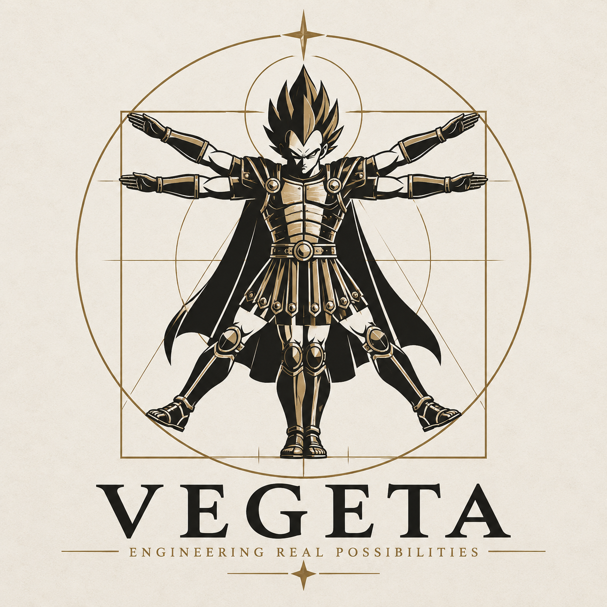

<p align="center"></p>

# Vegeta

A Python-first, human-in-the-loop engineering workbench built from small,
independent engineering tools, shipped together as one installable package, **`vegeta-cli`**
(`from vegeta import dedalus, talos, aeromant, mellonia`):

| Package | Job | Wraps | Consumes → Produces |
|---------|-----|-------|---------------------|
| **Dedalus** | parametric CAD | CadQuery | Python design → STEP, STL, measurements |
| **Talos** | linear static FEA | Gmsh + CalculiX | STEP + explicit config → mesh, `.inp`, `.frd`/`.dat`, summary |
| **Aeromant** | aerodynamics / CFD | OpenFOAM | STL + template case + explicit values → case, logs, Cd/Cl/Cm |
| **Mellonia** | 3D-print manufacturability | PrusaSlicer | STL + explicit print settings → G-code, time, material |
| **Vegeta Core** | workbench | the four above | workspaces, immutable revisions, recorded evaluations, NOT RUN |
| **Fidia** | AI modelling | Dedalus + `vegeta-ai` (Claude) | prompt → checked 3D model (glTF/GLB, OBJ, STEP); design copilot; campaigns |

Dedalus designs. Talos tests structures. Aeromant tests aerodynamics.
Mellonia tests manufacturability. Fidia sculpts from a prompt. Vegeta organizes the engineer's work.

Vegeta Core, Fidia and the AI connection are their own distributions next to `vegeta-cli`:
`vegeta-core`, **`vegeta-fidia`** and `vegeta-ai` (the provider layer only: keys, model, structured
output, images, cancellation, usage).

## Principles
- The four engineering tools are **independent** subpackages (`vegeta.dedalus`, ...): none imports
  another or any other part of Vegeta (enforced by tests). `vegeta` is a namespace package so more
  distributions can join it later.
- Each is a plain Python library, usable from a script or Jupyter, with a thin CLI on top
  (`vegeta <tool> ...`, or the shortcuts `dedalus`, `talos`, `aeromant`, `mellonia`).
  No server, database or background service. A GUI comes later, on top of the same API.
- Configuration happens in **Python** (dataclasses / keyword arguments), not config files.
- Packages compose through **files**: STEP, STL, meshes, CalculiX decks, OpenFOAM cases, G-code.
- Native solver artifacts are always kept; `summary.json` is a convenience, not a replacement.
- Nothing is guessed: supports, loads, materials, CFD values and print settings are explicit.
- Nothing runs automatically: every analysis is started by the engineer.

## Status
Stages 1–9 are implemented: the four independent tools (Python API, CLI, validated tests, docs,
notebooks) and Vegeta Core (workspaces, immutable revisions, branching, labels, recorded
evaluations, NOT RUN status; [docs/core.md](docs/core.md), `06_core_revisions`). Next: comparison and
sweeps, then a GUI — see [`todo.md`](todo.md).

| package | CLI | validation | guide | notebook |
|---------|-----|------------|-------|----------|
| Dedalus | `vegeta dedalus params/generate/measure` | exact box/hole volumes, STEP round trip | [docs/dedalus.md](docs/dedalus.md) | `01_dedalus_cad` |
| Talos | `vegeta talos inspect/mesh/solve/results` | cantilever vs beam theory (−0.6 %), bar F/A, gravity | [docs/talos.md](docs/talos.md) | `02_talos_fea` |
| Aeromant | `vegeta aeromant templates/prepare/run/results` | sphere Re=100 Cd 1.100 vs 1.092 | [docs/aeromant.md](docs/aeromant.md) | `03_aeromant_cfd` |
| Mellonia | `vegeta mellonia slice/parse` | layer counts, solid cube volume (+0.9 %) | [docs/mellonia.md](docs/mellonia.md) | `04_mellonia_print` |
| Boreas | `vegeta boreas point/for-thrust/map` | T~n², P~n³, momentum limit, APC 10x4.7 static point | [docs/boreas.md](docs/boreas.md) | propeller parts of `08_`, `09_` |
| Chronos | `vegeta chronos spectrum/life` | ASTM E1049 rainflow example, DAF = 1/2ζ at resonance, Miner sums | [docs/chronos.md](docs/chronos.md) | life parts of `08_`, `09_` |
| Chiron | `vegeta chiron info/run/metrics/render` | foot forces = m·g (1 %), contact decoding = `mj_contactForce` (1e-9), impulse Δv = J/m (1 %), servo torque–speed line, foot Jacobians = `mj_jac` (1e-12), bitwise-reproducible paired trials | [docs/chiron.md](docs/chiron.md) | `benchmark/cleopatra`, `benchmark/persephone` |
| Fidia | `vegeta fidia run/resume/show/propose/accept` | sandbox walls (timeout, memory, no keys), watertight/winding checks, glTF/GLB/OBJ re-import with trimesh and VTK | [docs/fidia.md](docs/fidia.md) | `15_fidia_prompt_to_3d`, `07_`, `10_` |

Product-level notebooks — one notebook per machine, the whole workflow on one design with revisions,
visualisation and a JSON record: `08_quadcopter` (printed X-frame: load cases, three revisions, drag with a
canopy, slicing; then the propeller and drive — BEMT, a rotating-frame CFD check, excitations, noise, a
blade FEA with a stress video; then modes, Campbell diagram, three mission types, rainflow spectra,
fatigue on the FEA stress fields and a fleet-usage life) and the twin-motor fixed wing in two notebooks:
`09a_fixed_wing_design` (wing pull-up and engine-out cases, whole-aircraft RANS, then the propeller on the
resulting drag polar with the same CFD/noise/blade/video treatment, then the whole aircraft in flight with its
propellers as rotor disks; it ends with a hand-off file) and `09b_fixed_wing_durability` (wing modes, missions
and life, then the whole fuselage over a long full-battery mission; it starts from 09a's hand-off, or recorded
values). `07_ai_design_copilot`
iterates a design with Claude; `10_agentic_design` lets Claude run a bounded parameter campaign (FEA on
every candidate, criteria, budget, approval policy) in a workspace; `15_fidia_prompt_to_3d` goes from a
prompt to an exported 3D model (plan, sandboxed build, checks, renders, review, feedback) and runs offline
with a scripted agent when no API key is set. Shared design files live in
`notebooks/designs/`. Every movie a notebook makes is written to `notebooks/output/<notebook>/`. The OpenFOAM cells run when you run them (`VEGETA_SKIP_OPENFOAM=1` skips them).
`11_rover_mechanics` (branch `dev_land`) is a small rugged-terrain rover: terrain profiles → quarter-car wheel
loads → arm, chassis and pin stresses over the operating cases (rocky peak, hill climbing, mud, heavy payload),
arm modes and a speed–frequency diagram, rainflow fatigue, life, printing.
`12_boat_at_sea` (branch `dev_sea`) takes a 1 m survey boat from hull lines through hydrostatics and the GZ
curve, resistance and propulsion in water, slamming and thrust structure, three sea states and fatigue life, then
its propeller in detail: performance and cavitation, a rotating-frame CFD check with a flow video, blade stress
with a video and modes, blade-passing noise, and one frequency diagram for bracket and blade. `13_submarine`
(`dev_sea`) is a 1.2 m AUV: buoyancy, trim lead and stability, resistance with a submerged RANS check, thruster
endurance and range, the pressure hull at its rated depth against thin-shell theory and collapse pressures,
the propeller (CFD, noise and cavitation, blade modes, Campbell), a dive simulation with a propulsion loss,
and dive profiles as pressure cycles. `14_submarine_propeller` (`dev_sea`) takes that propeller apart: pressure
against speed and depth down to cavitation, the fin wake (a model, or the hull's own CFD wake), rotor CFD at three
operating points, the flow in 3D with streamlines and tracer particles, OpenCV movies of the flow at each operating
point, blade FEA with its weak points, load harmonics with their frequencies and amplitudes, a frequency diagram
against blade and hull modes, blade response and fatigue, the noise spectrum, and design updates proposed by rules,
evaluated side by side, with a recommendation; then the recommendation (7 blades in nickel-aluminium bronze) made
quieter one measure at a time — skew, an anti-singing trailing edge, a damping alloy, a larger slower propeller,
fins moved upstream — each kept only if it is quieter without breaking a criterion.

`16_robot_dog` (branch `dev_sikarian`) is a 13 kg quadruped for patrols and stairs: CAD with a payload deck,
foot forces per gait (duty factor), joint torques over a stance, stairs and slopes with a payload, a drop from a
step, FEA of both leg links and the pins, lower-leg modes against stride harmonics, rainflow fatigue over three
missions, the trot as a sequence of leg angles with a movie, printing. Actuators, motors and joints for the dog and
the Myropods come from one shared catalogue, `notebooks/designs/actuators.py` (explicit entries with sources, a
selection helper and holding power). Walking is simulated by one shared stepping machine,
`notebooks/designs/gait.py` (terrain, body pose from the ground, foot stepping, inverse and forward kinematics and joint
torques for dog legs and Myropod legs), written for the dog and reused for Cleopatra and Persephone (whose feet land on a pipe
wall: `PipeContact`, `path_pose`). The **Myropods** (`dev_sikarian`) are a family of segmented walkers from one design file —
four legs on every segment, so each segment stands and braces on its own: `17_myropod_persephone` is the chimney
crawler (twelve 60 mm segments, 48 legs, a tether) in three versions — v1 the crawler (fit in flues and elbows,
bracing on soot and the servo class it needs, climb power and the tether, leg and shell FEA, a thermal limit in a
warm flue, the comms and power links, gait dynamics, leg fatigue), v2 transport into the chimney (coiled in a carry
case around its tether drum, the flue-mouth insertion guide, the push-in / anchor-and-pull / emergency-retreat
forces, case FEA), v3 two pincers on the head (grip, head moment, pincer FEA), and its gait from the hearth into the flue: 48 legs joint by
joint on the pipe wall through a 90° knee, with a step table and a movie; `18_myropod_cleopatra` is the
three-segment 12-legged walker (gaits, actuator torques, limb loss and the support polygon on three legs, leg FEA,
endurance, and its gait on open terrain: twelve legs joint by joint, the body joints between segments, a movie); `19_myropod_apheloria` (`designs/apheloria.py`) is the modular pill millipede that rolls into a ball
(configurations and module masses, ball geometry, rolling and a drop, the curl-up joint moment, plate and leg FEA,
endurance).

Project Onager — land robots (branch `dev_sikarian`): `20_onager_sentinel` (`designs/onager.py`) is the Onager
Sentinel SX-1, a 380 kg wheel-leg reconnaissance unit: CAD of the hull, turret, mast and four wheel-legs against
the datasheet envelope; mass budget and CG; wheel mode (resistance vs the hub motors' torque–speed line, grades,
the 0–38 km/h run, range and endurance); walking mode (stance torques, the joint modules and the speed they
allow); ISO 8608 terrains through a quarter car with the active leg as suspension, hull vibration PSDs, pitch,
leg and mast modes from Talos and a frequency diagram; static FEA of both leg plates, stub axle and knee pin; the
actuators under Chiron's servo model (a stand-up from the crouch, currents and the battery); and in MuJoCo through
ChironLab a patrol on gravel with a speed bump where a hub motor fails and a wheel seizes, two responses compared —
drag vs the three-wheel limp — with a movie each. `designs/onager_robot.py`, `onager_controller.py` and
`onager_scenario.py` are the Sentinel in ChironLab; `scenarios/onager_patrol.py` (or `./user_tests.sh onager`)
re-runs the patrol and writes the movies. `21_onager_atlas` (`designs/onager_atlas.py`) is the forklift: the Sentinel
chassis in a logistics stance with a tilting mast, lift carriage and forks (load chart and tipping, the stance's
knee torques, lift and tilt screws, fork FEA and mast modes, a quarter car with the pallet, and in MuJoCo a pallet
job — approach, lift, carry 8 m, set down — with a movie). `22_onager_manus` (`designs/onager_manus.py`) has two
manipulator arms with pincers (workspace and joint torques, the cutting envelope, why the jaws have hooked tips,
jaw and arm FEA, and in MuJoCo a track blocked by a wire it cuts — the wire parts only when both jaws squeeze it
with the cutting force — and a log it lifts off the track, with a movie). `scenarios/onager_atlas_pallet.py` and
`scenarios/onager_manus_tasks.py` (or `./user_tests.sh onager-atlas` / `onager-manus`) re-run them. `23_onager_sweeper`
(`designs/onager_sweeper.py`) is the street cleaner: the chassis low in a fixed stance, a bulky rounded body, a disc
broom with a suction hood behind it, the Manus arms and a basket on the roof (mass budget, broom and fan sizing,
power and endurance, the arms' reach to the road and the basket; the suction in CFD — Aeromant's new `suction_hood`
template: the depression, the lip inflow, which litter the hood lifts, a litter-particle movie; basket and hood FEA,
the broom's and fan's unbalance against their modes; and in MuJoCo a street with litter the hood vacuums — the CFD's
drag on Chiron props — and a brick and a box the pincers load into the basket, with a movie);
`scenarios/onager_sweeper_street.py` (or `./user_tests.sh onager-sweeper`) re-runs it.

**Drongo** (branch `dev_potato`): `08b_quadcopter_potato` gives notebook 08's quadcopter a job. Drongo is that quad
(`designs/drongo.py`, `Drongo(QuadFrame)`) with two skids and a rack-and-pinion pincer. It takes a 200 g potato (a sphere)
and then a 412 g cup of cream (a cylinder) from a basket (an open cube) in the supply zone to hungry people 36 m away, in two variants:
- **drop** — into a net the people hold; the item falls at most 5 m onto it, or the net tears. The net is not simulated:
  the catch happens at its plane, and its arrest is an assumed stretch.
- **place** — lowered calmly until it touches the drop zone, then let go.

The flight is MuJoCo through Chiron: rotor thrusts with lag and limits as a scene hook, a geometric flight controller,
the items as free bodies held by friction. A judge compares the contact forces with each item's squeeze, impact and
net-arrest limits. The propulsion is notebook 08's Boreas export when it exists, otherwise stated assumptions.
With the defaults nothing is spoilt. The hungry people wait **63 s** for both items when they are dropped and **72 s**
when placed. A faster cruise gains little; cruising lower (5.2 m) gains most. The notebook ends with a movie per variant;
`scenarios/drongo_delivery.py` (or `./user_tests.sh drongo`) re-runs them.

**Velutina** (branch `dev_velutina`): `24_velutina` (`designs/velutina.py`, `designs/velutina_flight.py`) is a printed
medical courier for the mountains — a slim body whose ogive nose is the medical capsule (with a grab handle), four pusher
propellers on short arms near the tail, cruciform fins, an emergency parachute in the tail cone; it flies 8 km and 1800 m
up at 40 m/s and delivers by setting the capsule down on a pad or by **hand-over**, hovering at a rock face or a tree
where a person takes it (the same airframe for flood rescue, rescue-team resupply and environmental sampling). The notebook:
mass budget from the CAD, a hand estimate of the drag areas with the propeller zones as actuator disks and a rudimentary
Aeromant screening at 0° and 10° (a `fast` preset; `VELUTINA_CFD=full` for a real run), Boreas propulsion at the depot and
in the thin air at the site, Talos FEA of the arm, the capsule and the body shell (the parachute's opening shock is the weak
case — the bridle goes to the arm frame next), modes against the rotor lines, the mission in a reduced 6-DOF flight model
with wind and gusts (set-down precision, station-keeping at the wall with GNSS vs a wall-relative sensor, energy reserve),
Chronos spectra and arm fatigue, printing, a rendered movie of the flight; `scenarios/velutina_mission.py` (or
`./user_tests.sh velutina`) re-runs the mission. **Velutina v2** (`designs/velutina_inspection.py`, notebook §11–12) is
the same airframe with a camera nose inspecting the blades of a parked onshore wind turbine (a half-real 2 MW machine):
wind shear and the tower's wind shadow, a camera model that sets the scan speed (motion blur, frame overlap) and the dwell
time at a suspect point (sharp frames inside a tolerance, from the simulated station keeping in the tower's wake), four
passes per blade along the leading edge, both sides and the trailing edge, the flight, the energy and the number of
battery charges, and a movie (`scenarios/velutina_mission.py --mode turbine`). To do: the parachute in CFD, propeller
guards, four rotor disks in the whole-aircraft CFD, the camera nose as a CAD part and a blade-relative sensor.

**Air propellers** (branch `dev_crazy_prop`): `25_air_propeller` (`designs/air_propeller.py`) is a 10 × 6 inch propeller on
the motor pod and pylon of a 3 kg fixed-wing drone, **tractor first, then pusher**, each with **two and three blades**:
aerodynamic efficiency from Boreas (η, C_T, C_P against J, η across the flight envelope at the thrust the drag polar needs,
loading along the blade); the air the blades meet (the pylon's leading-edge blockage ahead of a tractor, its viscous wake
behind it for a pusher) and the load on a blade over a revolution (with a Sears attenuation); OpenFOAM — the isolated
propellers (`rotor_mrf`), the installed ones (the new `rotor_mrf_installed`: rotating blades, standing pod and pylon, forces
apart → propeller and net efficiency), each over an rpm sweep, and the pod alone (its drag and the wake on the propeller plane);
**efficiency against rpm in six panels** — alone, tractor, pusher × two and three blades — at five airspeeds, with the
installation's effective wake (`boreas.wake.effective_inflow`) and thrust deduction (`installation_drag`), where the aircraft
flies, and the CFD sweep; 3D particles and a movie of tracer
balls through the four configurations with the pod drawn in; the blade in Talos spinning (the new `talos.Centrifugal`) and
loaded, weak points, modes, a Campbell diagram with spin stiffening, a stress movie; fatigue under the pusher's
once-per-revolution pulse; noise as Lowson's rotating dipoles (the new `boreas.wake.rotating_tones`) plus Schlegel–King–Mull
vortex noise (`boreas.vortex_noise`), dB and dB(A) (`boreas.a_weighting`), directivity, and the four sounds as WAV files at one
common scale. The CFD runs a **smoke test** by default (`AIR_PROP_CFD=smoke`, 20 cases of ~20 s); `AIR_PROP_CFD=full` (32 cases)
is the real run. The committed notebook is unexecuted (run it to get the outputs).

**MERLIN** (branch `dev_merlin`): `26_merlin` (`designs/merlin.py`, `designs/merlin_flight.py`) is a compact electric
fixed-wing for **rapid atmospheric sampling** — it leaves a launch stand, dashes to a reported wildfire, flies crosswind
passes through the smoke with a forward gas sensor and comes home for a belly landing — and asks **which propulsor gets
it to a fire 5, 8, 10, 20 or 30 km away fastest**: a nose **ducted fan** (the jet leaves as a ring around the fuselage), a
**tractor** or a **pusher** propeller, on one battery and one power limit. Nothing is designed twice: `Merlin` subclasses
09's `FixedWing` (wing, tail, sections) and builds its nose duct from 25's `EDFHousing`; the fan is `boreas.ducted` with
25's fitted losses, the propellers are Boreas BEMT in `air_propeller.installation_wake`'s effective wake with
`installation_drag`'s thrust deduction. The notebook: three variants in CAD, a drag build-up, wing FEA (pull-up and a dash
gust), optional RANS per variant; thrust and power against speed; the race (climb, accelerate, dash at the fastest speed
the energy for the way home allows) with the reach (first data by radio), return and landing times, on flat ground and
to a fire 600 m up a mountain (a gentle climb all along the dash); the winner as a rotor disk in CFD (optional); the mission through a Gaussian smoke
plume (Briggs rise, Pasquill–Gifford spread), the fire's heat release recovered from the passes, and a movie with the
smoke as particles. With the defaults the **pusher** is fastest at all three distances, the tractor a few seconds behind,
the ducted fan close only at 10 km (its jet costs twice the energy per kilometre). `scenarios/merlin_mission.py` (or
`./user_tests.sh merlin`) re-runs the race and the movie; `MERLIN_QUICK=1` runs the notebook as a quick check.

**The propulsion notebooks and the race** (branch `dev_rave`): each notebook computes its own propulsors and exports them;
the flight notebooks import and only fly. `25_air_propeller` compares two and three blades, tractor and pusher, and exports
its results (`designs/data/air_propeller_results.json`) and its propeller maps; `25b_ducted_fan` is the EDF (efficiency, CFD,
noise, vibration, **multi-stage fans** — two or three fan rings, `boreas.ducted`'s `stages`) compared with notebook 25's
export when it exists, and exports the fan maps; `25c_exotic_propellers` is six and twelve blades against notebook 25's two
and three, and exports their maps. The maps (`designs/data/propeller_maps.json`, `exotic_propeller_maps.json`,
`edf_maps.json`; `designs/propulsor_maps.py`) hold every design of a space solved over airspeed × rpm. MERLIN is split the
same way: `26_merlin` designs the aircraft and exports it (`designs/data/merlin_design.json`), `26b_merlin_mission` flies the
race to the fire, the mountain and the smoke mission from that export and the maps, and `27_merlin_race` asks whether any
reasonable ducted fan — 70–120 mm, any pitch and nozzle, a well-made duct, one to three stages, up to 3500 W from the same
battery — beats the propellers (two to twelve blades) in a 5 km out-and-back and a 10 km race: none does, and even a
lossless duct does not. `scenarios/propulsor_maps.py [--kind ...]` rebuilds the maps, `scenarios/merlin_race.py` re-runs the race.

**PEREGRINE** (branch `dev_peregrine`): `28_peregrine` (`designs/peregrine.py`, `designs/peregrine_flight.py`) is a cheap,
light electric fixed-wing inspired by the peregrine falcon that keeps wild animals and pest bird flocks off the crops with
the noise of its propeller (no acoustics: the sound does the job) — it patrols, stoops at a deer, flies between trees and
houses, herds a starling flock off the field, rests on the farmhouse ridge and starts again by hanging on its propeller.
The question: **does a wing that sweeps back in flight (the falcon's tuck) justify its engineering cost?** Three wings on
MERLIN's tractor body — A large fixed, B small fixed, C A's wing on two hinges (0–60° in flight, 85° stowed) — go through
the same tasks: a calculated bill of materials and lab hours, CAD, a new **vortex lattice** for the folded wing
(streamwise strips; checked against Helmbold and the elliptic wing), stability and trim against the fold, notebook 25's
propeller, envelopes, an agility chart against the pest birds and the peregrine, the stoop, the narrowest gap between
trees, boids flocks herded off the crop (after Paranjape et al.), prop-hang, hand throw and roof drop, wind on a perched
aircraft, wing and hinge-lug FEA with the fold servo from `actuators.py`, printing, the whole sortie as a movie, and a
decision table with a weight sensitivity. Findings with the defaults: a true root hinge collides beyond ~10° (the hinge
belongs at 30 % of the half span, the falcon's "elbow"); the tuck buys almost nothing in the stoop (it keeps the area)
but lets a stowed wing stay on a windy ridge (~9.7 m/s against ~6.5) and cuts the gust load in a dive; it costs ~95 g,
~35 EUR of parts and ~105 lab hours, and the small fixed wing B wins most weightings. The committed notebook is
unexecuted; `PEREGRINE_QUICK=1` runs it as a quick check; `./user_tests.sh peregrine` runs its tests.
**Microjet and AGUYA** (branch `dev_jet`): `28_microjet` builds a model turbojet in the workbench. It has a 1-D cycle
on its operating line (`vegeta.boreas.microjet`: a radial compressor, a choked or unchoked NGV and nozzle, and turbine
work = compressor work), calibrated to a datasheet's thrust, fuel flow and EGT for 100, 140 and 200 N classes. Its
impeller, turbine wheel and casing are in CAD (`designs/turbojet.py`). The compressor runs in compressible MRF CFD, one
speed-line point per back pressure (Aeromant `compressor_mrf`). The wheels run in FEA spinning and hot (Talos
`Centrifugal` + `RadialTemperature`, with stiffness and yield at temperature). The notebook exports
`designs/data/microjet.json`. `29_aguya` puts that engine into **AGUYA** (`designs/aguya.py`, `designs/aguya_flight.py`), a
turbojet sampler for MERLIN's job: a dorsal engine pod, a V-tail clear of the jet, and the fuel tank in the fuselage.
- **Sizing:** it flies the mission with fuel burn and sizes the tank per range.
- **Speed:** it reaches a fire 10 km out in about 80 s (MERLIN's best is about 157 s) and one 30 km out in about 200 s, at
  about 160 m/s.
- **Jet and exhaust:** it checks the hot jet against the V-tail (a free-jet estimate, then compressible CFD with the
  running engine, Aeromant `jet_external`) and whether the sensor samples its own exhaust.
- **Structure:** it runs the wing's gust load at the dash (above 10 g at 160 m/s: the gust penetration speed is about
  80 m/s) and its vibration modes.

**Pekari Rover** (branch `dev_track`): `30_pekari_rover` designs a small tracked (caterpillar) rover, the class of the
wheeled rover of notebook 11 — 19 kg empty, a 5 kg payload in the basket on its roof (the default configuration).
- **Machine:** a hull between two track modules (rear drive sprocket, front idler on a tensioner slide, four road wheels
  on two bogies, a return roller, a belt of 51 PA6-GF30 links with steel pins); CAD `designs/pekari_rover.py`, numbers
  and mass budget `designs/pekari_rover_robot.py`.
- **Ground:** ground pressure and Rowland's MMP, Bekker–Wong sinkage, compaction and thrust–slip per soil
  (`designs/terramechanics.py`), against the same load on the wheeled rover's wheels; resistance, traction, top speed per
  grade, the steepest grade per soil, range and endurance; tip-over, step, trench, road-wheel loads (`designs/tracks.py`).
- **Drive train:** the gear ratio window, a 16:1 two-stage planetary, Lewis and Hertz per stage, FEA on the sun pinion,
  tooth life over a patrol mission (`designs/gears.py`, Chronos).
- **Track:** belt tension, sag and derailing, pins by hand, FEA on a link and on the sprocket, link fatigue and hinge
  wear, skid steering (turning moment, pivot turns, clutch-brake vs regenerative power).
- **MuJoCo:** the rover in Chiron, with its tracks as rows of rollers, drives 3 m, makes a 90° turn and drives 2 m on
  rough ground with a log and stones. It produces the path, the side forces against the hand numbers, and a movie
  (`designs/pekari_controller.py`). Three trials then run the unchanged rover under failure rules, each movie ending
  at the frame where the mission fails: micro-hills of the rover's own radius with 15° slopes (crossed), a 30° hill
  (it stalls at the foot of the ramp: traction, as the hand calculation said) and moving, water-ish mud (crossed,
  pushed sideways).
The arms, the drive-type comparison and the terrain race against the other drives come next (todo 5j.4–5j.7); the two-segment
quad-track **Catagon** is its own product (todo 5k).

**NISUS** (branch `dev_nisus`): `31_nisus` is a 1.4 m twin-boom single-pusher survey drone in two variants from one airframe —
**Nisus-OBS** (remotely piloted observation: camera and live 5.8 GHz video, a flight controller with stabilisation and
return-to-home) and **Nisus-Zero** (the same aircraft with an NVIDIA Jetson for onboard computer vision, its camera, power
branch and data link). The notebook is the first engineering approximation:
- **Geometry:** CAD of every part (`designs/nisus.py`, a `FixedWing` subclass) with STEP/STL exports, a dimensioned
  three-view, the exploded assembly, the internal placement of both variants and the propeller's swept disk against the
  booms, the wing, the tail and the ground (`designs/nisus_drawings.py`).
- **Construction and mass:** materials by function (XPS, balsa D-box, carbon tubes, PETG / LW-PLA / TPU prints), load paths,
  mass budgets from the CAD and a sourced component table (`designs/nisus_systems.py`; market research of 2026-10-09 in
  `designs/data/nisus_component_sources.md`, no availability confirmed), CG, inertia, wing loading.
- **Electronics and propulsion:** per-variant load tables with duty cycles and regulator losses, the power branches, the
  propulsion requirement calculated before the selection (SunnySky X2216 KV1250 + APC 9×6E on 3S, fitted to the published
  static point; Boreas BEMT map), ESC and battery comparison.
- **Analyses:** the vortex lattice and a tagged derivative table (`designs/nisus_flight.py`), whole-aircraft RANS with the
  propeller as a rotor disk (`designs/nisus_cfd.py`), load cases from the flight envelope with hand checks and Talos FEA of the
  spars, a boom, the boom fitting, the motor mount and the battery tray (`designs/nisus_structure.py`), trim, CG range, control,
  stall, turns, gusts, pull-up, approach and provisional operating limits.
- **Mission:** the ten-minute survey's energy by phase (Wh, kWh, %), a derated pack, a return calculated from the route with
  the 20 % reserve, the battery iteration, the Jetson's 15–20 W sensitivity and the Orin substitution; then the missions in
  MuJoCo through Chiron (`designs/nisus_robot.py`, `nisus_controller.py`, `nisus_scenario.py`): hand launch, climb, survey,
  energy-triggered return, approach and landing for OBS (a scripted pilot) and Zero (the computer's waypoints), in calm air,
  a headwind, gusts and with a Jetson failure, with movies (chase and ground views, a synthetic onboard view, overlays).
`scenarios/nisus_mission.py` (or `./user_tests.sh nisus`) re-runs the missions. The FEA and CFD cells run when the notebook
runs (`NISUS_FEA=0`, `VEGETA_SKIP_OPENFOAM=1` skip them: NOT RUN); `NISUS_QUICK=1` flies only the calm missions.

`32_nisus_birds` is Nisus-Zero's bird-photography mission software, a prototype: track several birds, pick them one by
one, fly stern photo passes for close-ups, come home. The flight software is a general package, **`vegeta.mission`**
(no simulator, no ROS 2): typed messages on an in-process bus with a deterministic executor; the detector node (tiled
search and a target crop, latency; YOLOX is **not run**: `SimDetector` stands in, `YoloxTrtDetector` is the stub for the
TensorRT engine), an assumed Jetson compute budget (`compute`), a multi-bird tracker (ByteTrack-style association, an
IMM/EKF per bird in the camera's coordinates with log range from the bird's size, OC-SORT re-update), target selection
with hysteresis, photo-pass guidance with separation breakoffs, the shutter, and CLEAR-MOT/IDF1 scores.
`vegeta.mission.sim` holds the birds (species presets, thermals, flocks, flight from the drone), the simulated detector
and a kinematic aircraft. `designs/nisus_birds.py` plugs the stack into the MuJoCo Nisus-Zero (the flight controller's
mode 'birds'), `designs/nisus_birds_movie.py` renders the video (synthetic onboard view with boxes and tracks, chase
view, map, photo log). `scenarios/nisus_birds.py` (or `./user_tests.sh nisus-birds`) flies the six bird scenarios.

**FALCO** (branch `dev_falco`): `33_falco` is NISUS's bigger mountain sibling, one variant only, **Falco-Zero**
(autonomous, Jetson Orin Nano Super onboard): a 2.4 m, ~5.2 kg twin-boom pusher built to climb fast, descend fast and
work up to ~4500 m density altitude from valley meadows. It is an "energy plane": a 6S4P 21700 Li-ion pack (~335 Wh) and a
T-Motor AT4125 KV540 class drive with a fixed 15-inch propeller.
- **Geometry:** `designs/falco.py` (`Falco(Nisus)`): a two-piece wing with a carbon spar joiner (transport pieces ≤ 1.2 m),
  cut flaps and ailerons that can be posed (crow: flaps +55°, ailerons −25°), a bigger pod, booms and tail; drawings with the
  crow and transport views in `designs/falco_drawings.py`. NISUS gained only backward-compatible `design=` seams.
- **Systems:** `designs/falco_systems.py`: ISA with ΔT and Sutherland viscosity, the mass table and CG, a Li-ion pack model
  (OCV, resistance and capacity against temperature, no charging below 5 °C), the drive fitted to the published AT4125 point,
  a signed Boreas BEMT map that keeps the windmill and brake region (ESC active braking and regeneration), mission energy
  over a climb–survey–descent route (sources in `designs/data/falco_component_sources.md`).
- **Analyses:** `designs/falco_flight.py` (lattice with flap/aileron panels, crow increments, the envelope and ceiling
  against altitude, climb strategy, descent table, `regen_table`, downdraft escape, launch), `designs/falco_structure.py`
  (EAS gusts, hand checks, Talos FEA of the spar, joiner, boom, fitting, motor mount and tray), `designs/falco_cfd.py`
  (Aeromant cases at 3000 m air, crow and brake disk).
- **Answers:** climb 12 m/s at sea level and 9 m/s at 4500 m; crow + propeller brake sink ~14 m/s at 22 m/s EAS; fast climbs
  are the cheapest in energy; **regeneration does not pay in energy** (~2.6 Wh per 1000 m, under 2 % of the pack, none when
  the pack is cold) — the braked propeller is kept for its drag.
- **Mountain missions** in MuJoCo through Chiron over an analytic massif heightfield (`designs/falco_robot.py`: altitude-aware
  `FalcoAero`, `MountainWind` with shear, slope lift and lee sink; `falco_controller.py`: a TECS-style energy controller with
  crow and brake allocation, terrain floor and look-ahead, bungee launch, climb orbit, terrain-following slope survey, crow
  spiral descent, 9° crow approach and flare; `falco_scenario.py`: calm, ridge lift, lee downdraft, hot day, weather escape,
  Jetson failure, with movies). `designs/falco_birds.py` flies NISUS-Zero's bird mission software (`vegeta.mission`) on
  FALCO after golden eagles, griffon vultures and alpine choughs over the slope (`falco_birds_movie.py`).
`scenarios/falco_mission.py` and `scenarios/falco_birds.py` (or `./user_tests.sh falco`, `falco-birds`) re-run them;
`FALCO_QUICK=1` flies only the calm mission and one bird hunt in the notebook.

Benchmarks (`benchmark/`, branch `dev_sikarian`): `benchmark/cleopatra/full_benchmark.py` runs Cleopatra's pre-registered body-joint study in MuJoCo through Chiron — spring-only vs spring–damper intersegment joints × baseline vs load-feedback control over flat, bumpy, cross-slope and rough ground, speed sweeps, pushes, the undulation onset and damping/roll sensitivity (docs/myropod_stability.md) — and saves results.json, CSV, raw time series, plots and a report; `benchmark/persephone/full_benchmark.py` does the same for Persephone on the hearth (not yet validated; no flue). `./user_tests.sh` runs the test suites, the physics checks and the smoke benchmarks and prints a report to paste back.

Scenarios (scripts, not notebooks): `scenarios/air_video.sh [-j N]` builds the whole fixed-wing aircraft, runs one
CFD case with both propellers as rotor disks and writes a particle movie to `scenarios/output/`; on `dev_sea`
also `scenarios/sub_video.sh` (submarine) and `scenarios/boat_video.sh` (boat, double body, no free surface) — see
[scenarios/scenarios.md](scenarios/scenarios.md).

More: [philosophy](docs/philosophy.md) · [result shape](docs/result-shape.md) ·
[installation](docs/installation.md) · [composition through files](docs/composition.md) ·
[Vegeta Core](docs/core.md) · [Fidia: AI modelling](docs/fidia.md) · [AI provider layer](docs/ai.md).

### The names
Every tool is a figure from Greek myth, one word, easy to say in a meeting:
Dedalus the craftsman (CAD), Talos the bronze giant (structure), Aeromant "reader of the air" (CFD),
Mellonia the goddess of bees and their wax (3D printing), Boreas the north wind (propellers and
rotors), Chronos time (missions, cyclic loads, life), Chiron the centaur who trained the heroes (legged robots
walking in MuJoCo; ChironLab is where they train), Fidia — Phidias, the sculptor of the Parthenon —
(AI modelling from a prompt). The workbench itself is Vegeta.

## Layout
```
vegeta-cli/        the vegeta-cli package: src/vegeta/{cli,dedalus,talos,aeromant,mellonia,boreas,chronos,chiron}, tests/<tool>/
vegeta-core/       the vegeta-core package: src/vegeta/core (workspaces, revisions), adds `vegeta ws|rev`
vegeta-ai/         the vegeta-ai package: src/vegeta/ai (connection to the AI provider), adds `vegeta ai check|models`
vegeta-fidia/      the vegeta-fidia package: src/vegeta/fidia (prompt-to-3D, copilot, campaigns), adds `vegeta fidia`
notebooks/         one notebook per package, the workflow, core, AI copilot and two product designs
components/        geometry only: the machines' parametric CAD designs (Dedalus Design classes) the notebooks may use
assemblies/        geometry only: components arranged into machines (quadcopter, fixed wing, boat, submarine); see assemblies/README.md
docs/              philosophy, result shape, installation, composition, per-package guides
examples/cli/      input files for the CLI demo (Talos model, Aeromant case, Mellonia settings)
install_local.sh   creates .venv, installs all dependencies and vegeta-cli
test.sh            checks the installation (components + a short working run)
test_openfoam.sh   tests the CFD tool against every OpenFOAM installation found (or given), both flavours
jupyter.sh         starts JupyterLab from .venv
scripts/           test_all.sh, run_notebooks.sh, demo_cli.sh
```

## Quick start
```bash
./install_local.sh                  # .venv first, then apt tools, OpenFOAM, vegeta-cli, JupyterLab
./test.sh                           # check the installation; prints OK/MISSING/FAILED per part
./test_openfoam.sh                  # test Aeromant against the OpenFOAM installation(s) on this machine (.com and .org)
./jupyter.sh                        # JupyterLab from the venv; start with notebooks/00_smoke_test.ipynb
source .venv/bin/activate           # for the vegeta command and the scripts below
scripts/test_all.sh                 # each package tested on its own
scripts/run_notebooks.sh            # execute the notebooks headlessly
scripts/demo_cli.sh                 # CAD -> FEA -> print -> CFD using only the CLIs
```

## Licence
Proprietary — **internal use only** (see `LICENSE`). External tools keep their own licences, see
`THIRD_PARTY_LICENSES.md`.
